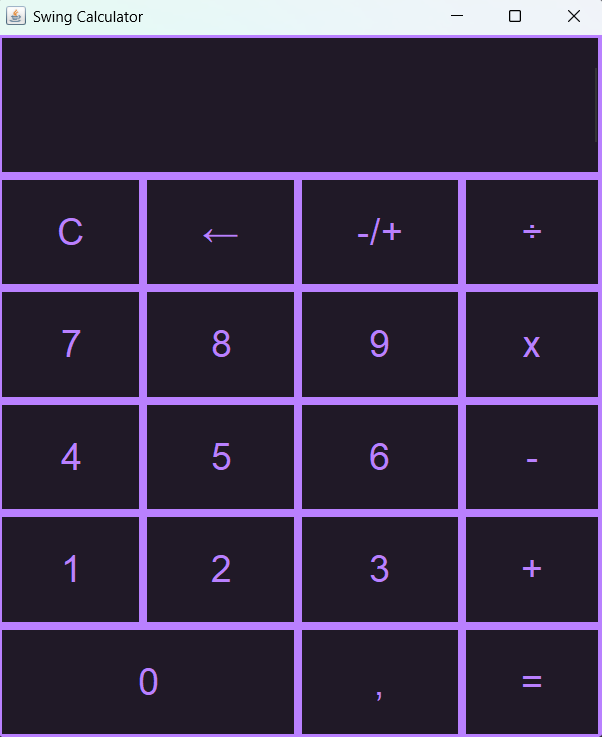

<u>

## INSTALLATION
</u>

<div style="padding: 10px; border: 1px grey solid; border-radius: 5px; padding-top: 20px; background-color: #00000000;">

<u>Get Repository</u>
> - Download the ZIP
> *https://github.com/DashNation/Swing-Testing/archive/refs/heads/main.zip*
> - Clone the repository
> ```git 
>$ git clone https://github.com/DashNation/Swing-Testing.git 
> ```

<u> Get JAVA: </u>
> *Download the newest version of the JAVA-SDK:*
> *https://www.oracle.com/java/technologies/downloads/#jdk26-windows*

<u> IDE Info: </u>
> *Use any IDE that can run java (I used VSCode with the "Extension Pack for Java")*
> *https://code.visualstudio.com/download*
> *https://marketplace.visualstudio.com/items?itemName=vscjava.vscode-java-pack*

</div>
<u>

## IDE SETUP
</u>

<div style="padding: 10px; border: 1px black solid; border-radius: 5px; padding-top: 20px;">

1. Open the project in your IDE
2. Run Main.java
    > - Terminal: ```Java src/main.java```
    > - Extension: Navigate to the `src`folder. Right click `Main.Java`, and then click `Run Java` on the *context menu*
3. Have fun using it even tho its a calculator
</div>

<u>

## KEYBINDS
</u>


- **" 0-9 "** and **"."** for **numbers**
- **" + "** for **addition**
- **"-"** for **substration**
- **" * "** for **multiplication**
- **" / "** for **dividing**
- **" Backspace "** to **delete** the **last number** on the screen
- **" Esc "** for **clearing** the calculator 
- **" I "** to **invert** the **current number**
- **" Enter "** to calculate the **result**

<u>

## Costumization
</u>


*Each element can be costumized using the following methods/functions:*

- **setBackground(String hexColor)**
- **setForeground(String hexColor)**
- **setLineBorder(String hexColor, int thickness)**
- **padding(int top, int left, int bottom, int right)**

<div style="height: 20px"></div>

<div style="border: 1px solid red; background-color: #f8d7da; color: #721c24; padding: 10px; border-radius: 5px;">
<strong>⚠️ DISCLAIMER: </strong> Some of the methods above might not work for some components
</div>

<u>

<div style="height: 20px"></div>

## CALCULATOR LOOKS
</u>

### *Default look:* 
</img>

 > *Remember you can change its looks with the few styling functions the project*